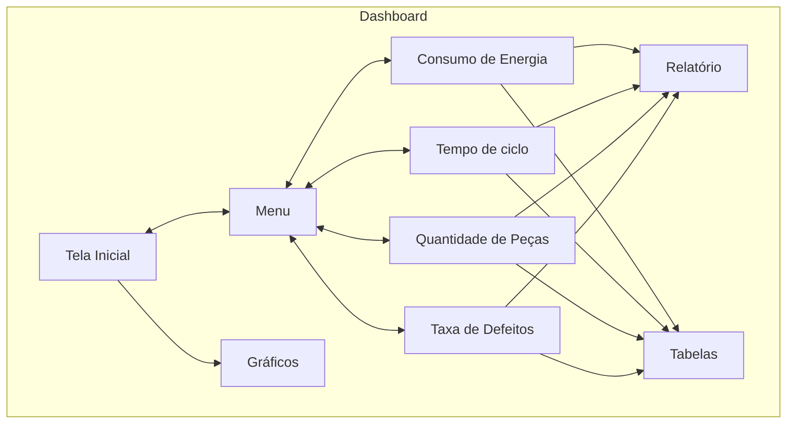
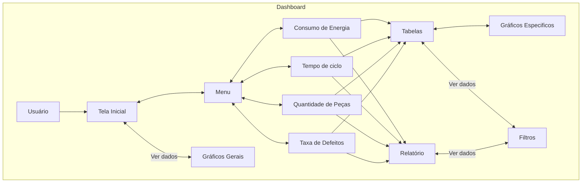

# PRD - Product Requirements Document (Template)

# *Introdução & objetivo*

Nosso sistema coleta dados em tempo real da sua linha de produção automotiva, garantindo armazenamento seguro e consultas rápidas. Com alertas inteligentes e automatização, você toma decisões ágeis, reduzindo custos e aumentando a eficiência, tudo com um ótimo custo-benefício para manter sua operação sempre fluindo.

# *Por que* implementar isto?

Implementar nosso sistema melhora o controle, reduz desperdícios e aumenta a eficiência da sua linha de produção. Com alertas inteligentes e automação, você antecipa problemas e mantém tudo em movimento, tudo isso com um excelente custo-benefício. É a solução perfeita para elevar a competitividade e a performance da sua operação.

---

# ***Público alvo***

Nosso produto foi desenvolvido para atender as exigências de gestores,  gerentes e engenheiros seja dos setores da Qualidade, como também de Operações.

| Perfil de usuário | Descrição, necessidades e interesses. |
| --- | --- |
| Gerentes | Acompanhamento da produção em tempo real, tempo de ciclo, gastos com defeitos e consumo    q   '   |
| Gestores | Acompanhamento de tempo de ciclo, percentual de defeitos e disperdicios de cada setor |
| Engenheiros | Acompanhamento de consumo energético e tempo de ciclo |

# *Personas*

1. **Gerente de Produção - Carla Moreira:**  Carla Moreira, com 20 anos de experiência, busca otimizar a produção automotiva e reduzir custos. Nosso sistema permite monitoramento em tempo real, armazenamento seguro de dados e automação, ajudando-a a antecipar problemas e tomar decisões estratégicas rapidamente.

2. **Gestor de Qualidade - Ricardo Santos**  Ricardo Santos, com 15 anos de experiência, garante que todos os produtos atendam aos padrões de qualidade. O sistema coleta dados em tempo real, oferece alertas para falhas e automatiza verificações, permitindo que Ricardo se concentre em melhorias contínuas.

3. **Engenheira de Produção - Luana Carvalho**  Luana Carvalho, com 8 anos de experiência, foca em automatizar e otimizar a linha de produção. Nosso sistema oferece dados rápidos, facilita a automação e justifica novos investimentos, ajudando Luana a implementar soluções eficientes e inovadoras.

---

# *Requisitos Funcionais*
## **Diagrama**

Diagrama de Caso de Uso para o Sistema de Coleta e Análise de Dados de Produção Automatizado

 Define o diagrama de caso de uso
 o "actor" representa os atores externos e "usecase" representa os casos de uso

 Início do diagrama

[Os requisitos funcionais descrevem as funcionalidades e capacidades específicas que o produto deve ter. Eles detalham o que o sistema deve fazer, as interações com os usuários e outras partes do sistema.]

1. **F1:** Para cada funcionalidade, inclua uma descrição detalhada, critérios de aceitação e, se aplicável, diagramas de fluxo ou casos de uso. **P1**
2. **F2:** Para cada funcionalidade, inclua uma descrição detalhada, critérios de aceitação e, se aplicável, diagramas de fluxo ou casos de uso. **P2**
3. **F3:** Para cada funcionalidade, inclua uma descrição detalhada, critérios de aceitação e, se aplicável, diagramas de fluxo ou casos de uso. **P3**

**P1** = **Crítico | P1 = Importante | P2 = Bom ter**

### *Casos de uso*

> **Caso de uso 1:** Descreva como os usuários utilizarão o produto em diferentes cenários. Isso ajuda a ilustrar a aplicação prática das funcionalidades.
> 

> **Caso de uso 2:** Descreva como os usuários utilizarão o produto em diferentes cenários. Isso ajuda a ilustrar a aplicação prática das funcionalidades.
> 

> **Caso de uso 3:** Descreva como os usuários utilizarão o produto em diferentes cenários. Isso ajuda a ilustrar a aplicação prática das funcionalidades.
> 

---

# *Requisitos Não Funcionais*

[Os requisitos não funcionais descrevem os critérios de desempenho, segurança, usabilidade e outras características que o sistema deve possuir. Eles garantem que o sistema funcione eficientemente sob diversas condições.]

1. **NF1:** Identifique aspectos como desempenho, segurança, usabilidade, confiabilidade, etc. **P1**
2. **NF2:** Identifique aspectos como desempenho, segurança, usabilidade, confiabilidade, etc. **P2**
3. **NF3:** Identifique aspectos como desempenho, segurança, usabilidade, confiabilidade, etc. **P3**

**P1** = **Crítico | P1 = Importante | P2 = Bom ter**

### 📊 Métricas

[Seja específico ao descrever os padrões ou métricas que devem ser atendidos. Inclua descrições detalhadas e, se possível, métricas mensuráveis.]

| Medida | Estado atual | Esperado | Resultados |
| --- | --- | --- | --- |
|  |  |  |  |
|  |  |  |  |
|  |  |  |  |

---

# *Fora de escopo*

<aside>
🚫 Liste todos os itens que estarão fora do escopo deste recurso do produto

</aside>

# *User Experience*

<aside>
🖍️ Crie links para seu arquivos de UX aqui: UX Flows, UI, etc.

</aside>

# *Dependências*

<aside>
⚠️ Quais necessidades que precisam ser supridas para que este produto/feature seja desenvolvido?

</aside>

# *Plano de lançamento*

*Crie uma lista de itens que precisão ser atendidos para o lançamento do produto no mercado, por exemplo:*

1. *Regras para lançamento interno:*
    - [ ]  *Validação*
    - [ ]  *Divulgação*

# 💌 *Plano de comunicação*

Quando as comunicações acontecerão? Quem será notificado sobre esse novo recurso? Enviaremos e-mails e notificações no aplicativo?

## *Links*
- [Miro](https://miro.com/app/board/uXjVKlCNuX4=/)